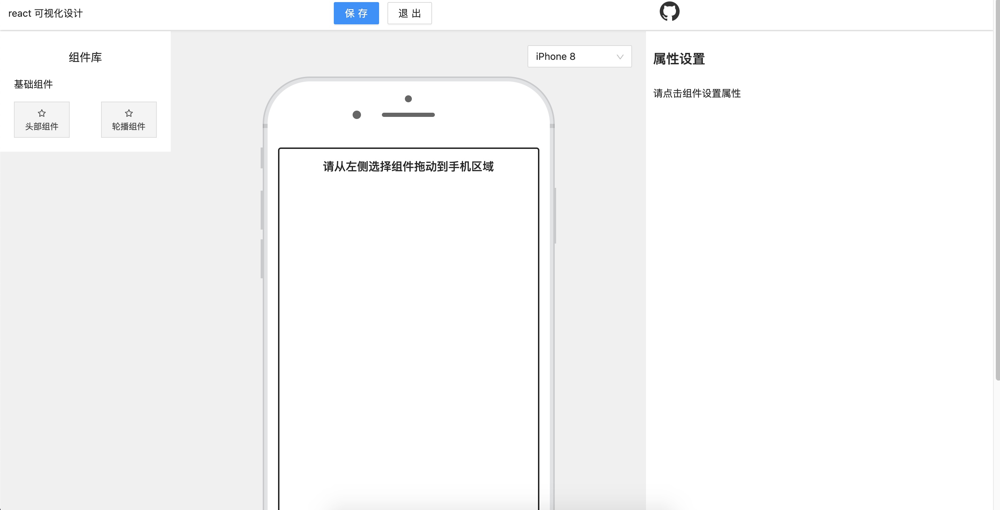
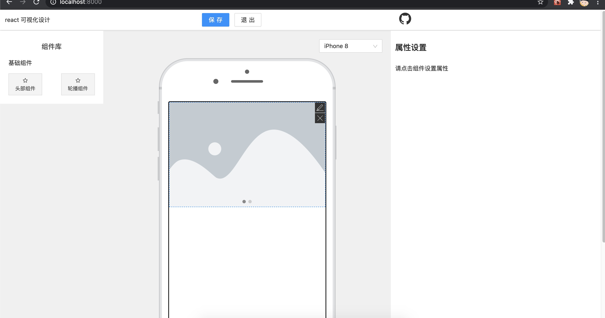
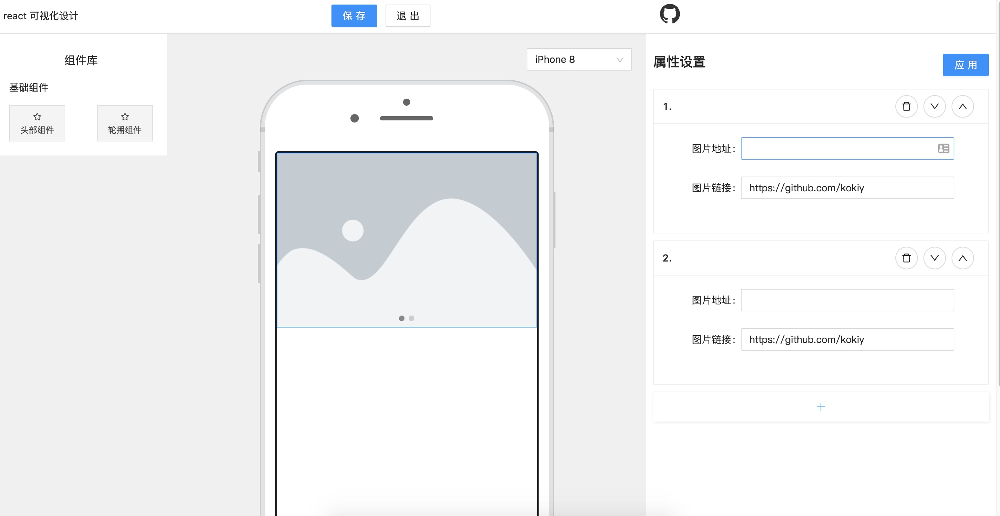

> react 基于组件的可视化设计

## [demo 地址](http://react-visual-design.kokiy.xyz/)

## feature

1. 整体框架基于[umijs](https://umijs.org/)
2. 表单组件基于[Formily schema](https://formilyjs.org/#/bdCRC5/dzUZU8il)
3. 拖拽基于[html5 drag&drop 属性](https://developer.mozilla.org/zh-CN/docs/Web/API/HTML_Drag_and_Drop_API)
4. 移动端组件基于[antd-mobile](https://mobile.ant.design/)

## 页面截图

  

## to do

1. 将生成的数据保存到数据库,持久化存储
2. 丰富组件库

## Build Setup

```bash
# install dependencies
yarn

# serve with hot reload at localhost:8080
yarn start

# build for production with minification
yarn build
```
